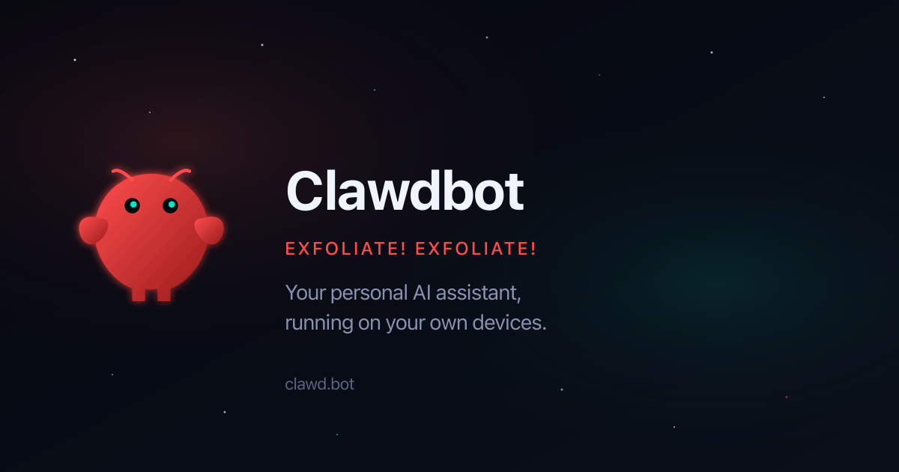

# openclaw.ai 🦞 — The lobster's front door

[](https://github.com/openclaw/openclaw.ai/actions/workflows/install-smoke.yml)
[](https://openclaw.ai)

`openclaw.ai` is the public website for [OpenClaw](https://github.com/openclaw/openclaw). This repository is for contributors maintaining the landing pages, blog, ecosystem directory, and hosted installer endpoints; product documentation lives at [docs.openclaw.ai](https://docs.openclaw.ai).



## Install

The website is source-only and uses Bun:

```sh
git clone https://github.com/openclaw/openclaw.ai.git
cd openclaw.ai
bun install --frozen-lockfile
```

The package manifest is private, and the site is not distributed through npm, Homebrew, or GitHub Releases.

## Quick start

Start the local Astro development server:

```sh
bun run dev
```

Open [http://localhost:4321](http://localhost:4321). Changes under `src/` reload automatically.

## Site map

| Surface | Path | Purpose |
| --- | --- | --- |
| Home | [`/`](https://openclaw.ai/) | Product overview and first-run path |
| Integrations | [`/integrations`](https://openclaw.ai/integrations) | Channels, models, platforms, and tools |
| Ecosystem | [`/ecosystem`](https://openclaw.ai/ecosystem) | OpenClaw-related projects |
| Showcase | [`/showcase`](https://openclaw.ai/showcase) | Community projects and examples |
| Blog | [`/blog`](https://openclaw.ai/blog) | Project articles and announcements |
| Podcast | [`/podcast`](https://openclaw.ai/podcast) | ClawCast episodes |
| Press | [`/press`](https://openclaw.ai/press) | Selected coverage |
| Shoutouts | [`/shoutouts`](https://openclaw.ai/shoutouts) | Community mentions |

The canonical product docs remain on [docs.openclaw.ai](https://docs.openclaw.ai); this site summarizes and routes to them.

## Hosted installers

The production site serves the macOS/Linux, CLI-only, and Windows OpenClaw installers from `public/`. Their supported runtimes, install methods, maintenance contract, and troubleshooting notes are in [docs/installers.md](docs/installers.md).

Installer changes need both local tests and live-path verification because these files are executable user entry points. The main GitHub Actions checks are [Install Smoke](https://github.com/openclaw/openclaw.ai/actions/workflows/install-smoke.yml) and [Install Matrix](https://github.com/openclaw/openclaw.ai/actions/workflows/install-matrix.yml).

## Deployment

The site builds as static Astro output and is served by Vercel. [`vercel.json`](vercel.json) owns production redirects, headers, and cache rules; [`astro.config.mjs`](astro.config.mjs) owns the canonical site URL and build output.

## Contributing

Read [VISION.md](VISION.md) for the product boundary and [CONTRIBUTING.md](CONTRIBUTING.md) for accepted changes before opening a pull request. Broad redesigns and editorial work require maintainer direction.

## Development

```sh
bun test
bun run build
bun run preview
```

The preview server serves the production build at [http://localhost:4321](http://localhost:4321). Use `bun run test:built-assets` when changing generated routes or public assets.

## Project links

- [OpenClaw repository](https://github.com/openclaw/openclaw)
- [Documentation](https://docs.openclaw.ai)
- [Discord](https://discord.gg/openclaw)

## License

This repository does not currently declare a license.
